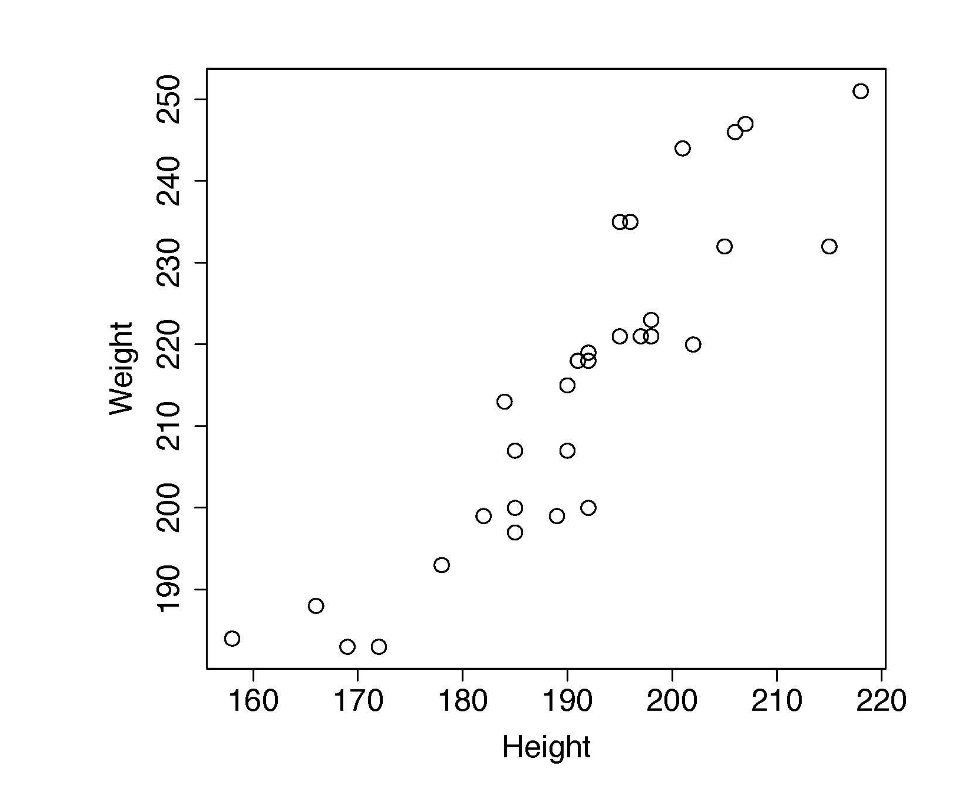
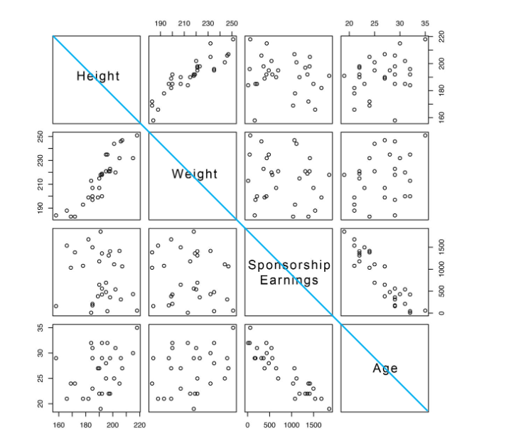

# 1. 描述统计（Descriptive Statistics）

数据探索贯穿 CRISP-DM 的 **Data Understanding** 与 **Data Preparation**。描述统计用集中趋势、变异程度等标准度量刻画 ABT 中的每个特征。

**探索总目标：**

1. 熟悉 ABT 中各特征的集中趋势、变异与分布形态
2. 识别质量问题：缺失值、不规则基数、离群点
3. 修正因**无效数据**导致的问题
4. 将因**有效数据**导致的问题记入 Data Quality Plan，并写明处理策略
5. 确认数据质量与数量足以支撑后续建模

---

## 1.1 连续特征（Continuous Features）

### 1.1.1 集中趋势（Central Tendency）

| 指标 | 定义 | 公式 / 说明 |
|------|------|-------------|
| **均值 Mean** | 算术平均 | $\bar{a}=\dfrac{1}{n}\sum_{i=1}^{n}a_i$ |
| **中位数 Median** | 排序后中间值 | $n$ 为偶数时，取中间两值的均值 |

- 样本（sample）：特征在 ABT 中的一组取值
- 集中趋势只是对“中心位置”的**近似**
- 中位数对极端值更稳健

### 1.1.2 变异程度（Variation）

> 统计与分析的核心在于描述和理解**变异（variation）**。

| 指标 | 公式 | 说明 |
|------|------|------|
| **极差 Range** | $\max(a)-\min(a)$ | 最简单的变异度量 |
| **方差 Variance** | $\mathrm{var}(a)=\dfrac{1}{n-1}\sum_{i=1}^{n}(a_i-\bar{a})^2$ | 与均值的平均偏离；样本方差分母为 $n-1$ |
| **标准差 Std** | $sd(a)=\sqrt{\mathrm{var}(a)}$ | 与原变量同量纲 |
| **百分位 Percentiles** | 第 $i$ 百分位：约 $i/100$ 的取值 ≤ 该值 | 见下 |
| **四分位距 IQR** | $Q_3-Q_1$ | 25th = 下四分位 $Q_1$；75th = 上四分位 $Q_3$ |

**百分位计算步骤：**

1. 将 $n$ 个值升序排序
2. 计算 $index = n \times i/100$
3. 若 $index$ 为整数 → 取第 $index$ 个位置的值
4. 若 $index$ 非整数 → 令 $index\_w$ 为整数部分、$index\_f$ 为小数部分，插值：
   $$
   \text{percentile} = (1-index\_f)\times a_{index\_w} + index\_f \times a_{index\_w+1}
   $$

**例（$n=8$）：**

- 25th：$0.25\times 8 = 2$ → 取排序后第 2 个值
- 80th：$0.80\times 8 = 6.4$ → $0.6\times a_6 + 0.4\times a_7$

---

## 1.2 分类特征（Categorical Features）

| 概念 | 定义 |
|------|------|
| **频数 Frequency count** | 该水平在样本中出现的次数 |
| **占比 Proportion** | 频数 ÷ 样本总量 |
| **频数表 Frequency table** | 各水平频数与占比的汇总表 |
| **众数 Mode** | 出现最多的水平（分类特征的集中趋势） |
| **第二众数 2nd mode** | 第二常见的水平 |

---

## 1.3 总体与样本（Population & Sample）

| 术语 | 含义 |
|------|------|
| **总体 Population** | 研究/分析中关心的全部可能观测或结果 |
| **样本 Sample** | 从总体中选出、实际用于分析的子集 |

- 民调中的 **margin of error（误差范围）** 反映结果基于样本而非总体

---

# 2. 数据可视化（Data Visualization）

| 图型 | 适用 | 要点 |
|------|------|------|
| **条形图 Bar plot** | 分类特征 | 可画频数、占比（density）、按占比排序（ordered）；**不能**直接用于连续特征 |
| **直方图 Histogram** | 连续特征 | 将取值范围切成 bins，统计各 bin 频数/密度 |
| **箱线图 Box plot** | 连续特征 | 中位数、Q1、Q3、须，便于看分布与离群 |


---

## 2.1 常见直方图形态

| 形态 | 含义 | 例子 |
|------|------|------|
| **Uniform 均匀** | 各区间取值概率大致相同 | — |
| **Normal 正态（单峰）** | 向中心集中，两侧近似对称 | 身高、体重 |
| **Skewed right 右偏** | 长尾在右侧（高值） | 收入等 |
| **Skewed left 左偏** | 长尾在左侧（低值） | — |
| **Exponential 指数** | 低值概率很高，随数值增大迅速衰减 | — |
| **Multimodal 多峰** | 两个或更多明显分离的高发区间 | 特征混合了多个子群体 |

## 2.2 正态分布（Normal / Gaussian）

**概率密度函数：**

$$
N(x\mid\mu,\sigma)=\frac{1}{\sqrt{2\pi}\,\sigma}\,e^{-\frac{(x-\mu)^2}{2\sigma^2}}
$$

- $x$：任意取值
- $\mu$：总体均值（控制位置）
- $\sigma$：总体标准差（控制宽度）

**标准正态分布：** $\mu=0,\ \sigma=1$

**68–95–99.7 法则：**

| 范围 | 大约包含的观测比例 |
|------|--------------------|
| $\mu \pm 1\sigma$ | 68% |
| $\mu \pm 2\sigma$ | 95% |
| $\mu \pm 3\sigma$ | 99.7% |

---

# 3. 数据质量报告（The Data Quality Report）

对 ABT（Analytics Base Table）中每个特征，用集中趋势与变异度量做**表格报告**，并配可视化：

- 连续特征 → **直方图**
- 分类特征 → **条形图**

### 3.1 报告表格结构

| 连续特征表字段 | 分类特征表字段 |
|----------------|----------------|
| Count / Missing % | Count / Missing % |
| Cardinality | Cardinality |
| Mean / Min / Max | Mode / Mode % |
| 1st Q / Median / 3rd Q | 2nd Mode / 2nd Mode % |
| SD / IQR | |

### 3.2 关键字段

- **Cardinality**：该特征在 ABT 中的不同取值个数
- **Mode / Mode %**：最常见水平及其占比
- **2nd Mode / 2nd Mode %**：第二常见水平及其占比

### 3.3 读表要点

**分类特征：**

- 看 mode、2nd mode 及其占比
- 判断是否有某水平**主导**数据集

**连续特征：**

- mean 与 std → 集中趋势与波动
- min 与 max → 可能取值范围

---

# 4. 识别数据质量问题（Identifying Data Quality Issues）

## 4.1 定义与分类

**数据质量问题**：ABT 中任何“不寻常”的数据。

| 类型 | 原因 | 处理原则 |
|------|------|----------|
| **无效数据** | 生成 ABT 的流程出错 | 立即修正 → 重新生成 ABT 与质量报告 |
| **有效数据** | 真实世界如此 | 记入 Data Quality Plan，选处理策略 |

## 4.2 三大常见问题

### （1）缺失值 Missing values

- 查看 Missing %
- 注意异常模式：如“大量为 0”

### （2）不规则基数 Irregular cardinality

基数与特征定义预期不符时，视为问题。

**检查清单：**

- [ ] Cardinality = 1（常量特征，无信息）
- [ ] 分类特征被标成连续（或连续被标成分类）
- [ ] 分类特征基数远超定义预期
- [ ] 水平数过多（如 >50）需调查

### （3）离群点 Outliers

- **定义**：远离特征集中趋势的取值
- **识别方法**：
  1. 用 min / max + **领域知识**判断是否合理
  2. 比较 median、min、max、Q1、Q3 的间距
  3. 若 **Q3 与 max 的间距**明显大于 **median 与 Q3 的间距** → max 很可能是离群点

## 4.3 讲义案例（车险欺诈 ABT）

| 问题类型 | 具体表现 |
|----------|----------|
| 缺失 | NUM. SOFT TISSUE 约 2%；MARITAL STATUS >60%；INCOME 大量为 0 |
| 基数 | INSURANCE TYPE=1；FRAUD FLAG 实为分类却当连续；多个 count 型特征基数 <10 |
| 离群 | CLAIM AMOUNT 最小值 −99,999（错误）；个别高额保单/重伤导致 max 异常高 |

---

# 5. 处理质量问题（Handling Data Quality Issues）

## 5.1 缺失值

| 策略 | 做法 |
|------|------|
| Approach 1 | 直接删掉有缺失的特征 |
| Approach 2 | **Complete case analysis**：只保留完整样本 |
| Approach 3 | 派生 **missing indicator** 特征（标记是否缺失） |
| **Imputation 填补** | 用已有值估计一个合理值替换缺失；最常用**集中趋势**（均值/中位数） |

**填补经验阈值：**

- 缺失 **>30%**：通常不愿做填补
- 缺失 **>50%**：强烈不建议填补

## 5.2 离群点 — Clamp（截断）

把超过上下阈值的取值压到阈值：

$$
a_i \leftarrow
\begin{cases}
\text{lower} & a_i < \text{lower}\\
\text{upper} & a_i > \text{upper}\\
a_i & \text{otherwise}
\end{cases}
$$

### 阈值设定方法一：IQR 法（箱线图思路）

$$
\begin{aligned}
\text{lower} &= Q_1 - 1.5 \times \mathrm{IQR}\\
\text{upper} &= Q_3 + 1.5 \times \mathrm{IQR}
\end{aligned}
$$

**例（CLAIM AMOUNT）：**

- lower = 3,322.3 − 1.5 × 8,923.2 = **−10,062.5**
- upper = 12,245.5 + 1.5 × 8,923.2 = **25,630.3**

IQR 是 Interquartile Range 的缩写，中文叫**四分位距**。它表示数据中间 50% 的分布范围，计算公式是：

$$
\mathrm{IQR}=Q_3-Q_1
$$

### 阈值设定方法二：均值 ± 2×标准差

$$
\begin{aligned}
\text{lower} &= \bar{a} - 2 \times sd(a)\\
\text{upper} &= \bar{a} + 2 \times sd(a)
\end{aligned}
$$

**例（AMOUNT RECEIVED）：**

- lower = 13,051.9 − 2 × 30,547.2 = **−48,042.5**
- upper = 13,051.9 + 2 × 30,547.2 = **74,146.3**

## 5.3 Data Quality Plan

所有质量问题及处理策略应写入 **数据质量计划（Data Quality Plan）**，便于复现与团队协作。

---

# 6. 高级数据探索 —— 特征之间的关系可视化


在认识**单个特征**的分布与质量之后，进一步探索**特征之间的关系**。

**本阶段主线：**

```text
关系可视化（散点 / SPLOM / 小多图 / 堆叠条形 / 分组直方 / 箱线）
    → 协方差与相关（数值度量 + 矩阵）
    → 数据准备（归一化 / 分箱 / 抽样）
    → 进入建模
```

---

## 6.1 特征对特征：怎么画关系图

| 特征组合 | 推荐图型 | 看什么 |
|----------|----------|--------|
| **连续 × 连续** | 散点图 Scatter plot | 正/负相关、线性与否、离群 |
| **连续 × 连续（多组）** | 散点图矩阵 SPLOM | 两两关系全景 |
| **分类 × 分类** | 小多图条形图 / 堆叠条形图 | 各水平组合下的相对结构 |
| **分类 × 连续** | 分组小多图直方图 / 分组箱线图 | 各水平下连续特征的分布差异 |

---

### 6.1.1 连续 × 连续：散点图（Scatter Plot）

- 横轴一个特征，纵轴另一个特征
- 每个实例是一个点，坐标由这两个特征的取值决定

**读图要点（讲义 Fig 3.5）：**

| 形态 | 含义 | 例 |
|------|------|----|
| 点带向右上方 | **强正协变** | HEIGHT 与 WEIGHT |
| 点带向右下方 | **强负协变** | SPONSORSHIP EARNINGS 与 AGE |
| 点云无明显趋势 | **弱相关 / 几乎无关** | HEIGHT 与 AGE |


---

### 6.1.2 连续 × 连续（多特征）：散点图矩阵（SPLOM）

- 把一组连续特征的两两散点图排成矩阵
- 适合快速扫一遍 ABT 里所有连续特征之间的关系

**扩展：** 在对角线上方标上相关系数，SPLOM 就变成“相关矩阵的可视化”。

---

### 6.1.3 分类 × 分类：小多图条形图 / 堆叠条形图

**小多图条形图（Small multiple bar plots）**

- 对其中一个特征的每个水平，画一张“另一特征”的条形图
- 便于比较不同水平下，另一特征的频数/占比结构
  

**堆叠条形图（Stacked bar plot）**

- 当其中一个特征的**水平数 ≤ 3** 时，可用堆叠条形作小多图的替代
- 一根柱子内分段显示另一特征各水平的构成

---

### 6.1.4 分类 × 连续：分组直方图 / 分组箱线图

**小多图直方图（Small multiple histograms）**

- 对分类特征的每个水平，画该水平下连续特征的直方图
- 比较：位置不同（中心差异）？宽度不同（变异差异）？形状不同？

**分组箱线图（Box plots by level）**

- 对分类特征的每个水平，画对应连续特征的一个箱线图
- 便于并排比较中位数、IQR、离群点
- 例：按 POSITION 比较 AGE / HEIGHT

---

# 7. 协方差与相关（Covariance & Correlation）

散点图是**看**关系；协方差与相关是**算**关系（尤其针对两个连续特征）。

---

## 7.1 样本协方差（Sample Covariance）

对特征 $a,b$，样本量 $n$：

$$
\mathrm{cov}(a,b)=\frac{1}{n-1}\sum_{i=1}^{n}(a_i-\bar{a})(b_i-\bar{b})
$$

**取值范围与含义：**

| 取值 | 含义 |
|------|------|
| **> 0** | 正关系（同增同减） |
| **< 0** | 负关系（一增一减） |
| **≈ 0** | 几乎没有线性关系 |

**特点：** 数值落在 $[-\infty,+\infty]$，**受量纲影响**，难直接比较不同特征对。

**例（篮球数据集）：**

- $\mathrm{cov}(\text{HEIGHT},\text{WEIGHT})=241.7$（强正）
- $\mathrm{cov}(\text{HEIGHT},\text{AGE})=19.7$（相对较弱）

---

## 7.2 相关（Correlation）：标准化的协方差

$$
\mathrm{corr}(a,b)=\frac{\mathrm{cov}(a,b)}{sd(a)\times sd(b)}
$$

**取值范围与含义（$[-1,+1]$）：**

| 取值 | 含义 |
|------|------|
| **→ +1** | 很强正相关 |
| **→ −1** | 很强负相关 |
| **→ 0** | 几乎不相关（讲义称此时可视为 independent） |

**例：**

$$
\mathrm{corr}(\text{HEIGHT},\text{WEIGHT})=\frac{241.7}{13.6\times 19.8}\approx 0.898
$$

$$
\mathrm{corr}(\text{HEIGHT},\text{AGE})=\frac{19.7}{13.6\times 4.2}\approx 0.345
$$

---

## 7.3 协方差矩阵与相关矩阵

多个连续特征 $\{a,b,\ldots,z\}$ 时，两两关系汇总成矩阵。

**协方差矩阵 $\Sigma$：**

$$
\Sigma=
\begin{bmatrix}
\mathrm{var}(a) & \mathrm{cov}(a,b) & \cdots & \mathrm{cov}(a,z)\\
\mathrm{cov}(b,a) & \mathrm{var}(b) & \cdots & \mathrm{cov}(b,z)\\
\vdots & \vdots & \ddots & \vdots\\
\mathrm{cov}(z,a) & \mathrm{cov}(z,b) & \cdots & \mathrm{var}(z)
\end{bmatrix}
$$

- 对角线 = 各特征方差
- 非对角线 = 两两协方差

**相关矩阵：**

$$
\begin{bmatrix}
\mathrm{corr}(a,a) & \mathrm{corr}(a,b) & \cdots & \mathrm{corr}(a,z)\\
\mathrm{corr}(b,a) & \mathrm{corr}(b,b) & \cdots & \mathrm{corr}(b,z)\\
\vdots & \vdots & \ddots & \vdots\\
\mathrm{corr}(z,a) & \mathrm{corr}(z,b) & \cdots & \mathrm{corr}(z,z)
\end{bmatrix}
$$

- 对角线 = 1
- 非对角线 = 两两相关系数

**例（Height, Weight, Age）相关矩阵：**

$$
\begin{bmatrix}
1.0 & 0.898 & 0.345\\
0.898 & 1.0 & 0.294\\
0.345 & 0.294 & 1.0
\end{bmatrix}
$$

**SPLOM ≈ 相关矩阵的可视化**（可在对角上方标相关系数）。

---

## 7.4 相关的局限（必考思想）

### 7.4.1 Anscombe’s Quartet（安斯库姆四重奏）

1973 年统计学家 F. J. Anscombe 构造的四组数据，统计量几乎相同，图形却天壤之别：

| 统计量（四组相同） | 值 |
|--------------------|-----|
| $x$ 均值 | 9.0 |
| $y$ 均值 | 7.5 |
| $x$ 方差 | 10.0 |
| $y$ 方差 | 3.75 |
| 相关系数 | 0.816 |
| 线性回归线 | $y=3+0.5x$ |

**启示：分析数据之前，一定要画图。**
相关系数相同，不代表数据关系相同（线性、非线性、离群主导、杠杆点等）。

### 7.4.2 相关 ≠ 因果（Correlation ≠ Causation）

误判因果的两大方式：

1. **因果顺序弄反**
   - 燕子多导致天热？
   - 风车转导致刮风？
   - 打篮球导致长高？

2. **忽略第三变量（混杂因素 confounding feature）**
   - 经典案例：1999 年《Nature》文章称幼儿开小夜灯睡觉与日后近视有关
   - 后续研究无法复现
   - 真正原因是**混杂特征**同时影响两变量，造成虚假因果

---

# 8. 数据准备（Data Preparation）

目标：改变数据表示，使之更适配后续机器学习算法。三项：**Normalization / Binning / Sampling**。

---

## 8.1 归一化（Normalization）

**目的：** 把连续特征变换到指定范围，**保持取值之间的相对差异**。

### 8.1.1 范围归一化（Range Normalization）

映射到 $[low,\ high]$：

$$
a_i' = \frac{a_i-\min(a)}{\max(a)-\min(a)}\times(high-low)+low
$$

- 常用：映射到 $[0,1]$ 或 $[-1,1]$
- 依赖 min/max，对离群点敏感

### 8.1.2 标准分数（Standard Scores / z-score）

$$
a_i' = \frac{a_i-\bar{a}}{sd(a)}
$$

- 含义：该取值距离均值有多少个标准差
- 变换后：均值 ≈ 0，标准差 ≈ 1
- 不强制限定在固定区间

**对比：**

| 方法 | 变换后范围 | 关注点 |
|------|------------|--------|
| Range normalization | 固定 $[low,high]$ | 相对位置保留，受极值影响 |
| Standard scores | 理论上 $(-\infty,+\infty)$ | 以均值/标准差为基准 |

---

## 8.2 分箱（Binning）

**目的：** 把**连续特征**转换成**分类特征**。
定义一系列区间（bins），每个区间对应新分类特征的一个水平。

### 8.2.1 箱数怎么选（Trade-off）

| 箱数过少 | 箱数过多 |
|----------|----------|
| 丢失大量信息 | 每箱样本太少，甚至空箱 |

### 8.2.2 等宽分箱（Equal-width binning）

- 把取值范围均分成 $b$ 个箱，每箱宽度 $=\dfrac{\mathrm{range}}{b}$
- 箱边界在数值上等距

**注意：** 对偏态数据，中间箱可能很空、两端很挤。

### 8.2.3 等频分箱（Equal-frequency binning）

1. 将取值升序排序
2. 把样本尽量均分成 $b$ 组，每组约 $n/b$ 个实例
3. 从 bin 1 开始依次填入

**注意：** 每箱样本数相近，但箱宽可能差异很大。

**对比：**

| 方法 | 等什么 | 适合 |
|------|--------|------|
| Equal-width | 箱的**宽度** | 分布较均匀、无极端偏态 |
| Equal-frequency | 箱内**样本数** | 偏态分布、希望各箱样本充足 |

---

## 8.3 抽样（Sampling）

**何时用：** ABT 过大，只用其中一部分即可。
**核心要求：** 样本仍要**代表**原数据，避免引入**无意偏差**。

### 8.3.1 Top sampling（顶部抽样）

- 取数据集前 $s\%$ 的实例
- **风险高**：受原始排序影响，极易引入偏差
- **讲义建议：避免使用**

### 8.3.2 Random sampling（随机抽样）★推荐默认

- 从大数据集中随机抽取 $s\%$ 的实例
- 随机性有助于避免偏差，多数场景的默认选择

### 8.3.3 Stratified sampling（分层抽样）

**目标：** 保持某个**分层特征（stratification feature）**各水平的相对频率与原数据一致。

**步骤：**

1. 按分层特征的水平分成若干层（strata）
2. 在**每一层内**随机抽 $s\%$
3. 合并各层 → 得到整体 $s\%$ 的样本

**适用：** 总体中某类较少但很重要，希望样本结构与总体一致。

### 8.3.4 Under-sampling / Over-sampling（欠采样 / 过采样）

**目标：** 与分层相反——**故意改变**某特征各水平的相对频率（常见于类别不平衡）。

| 方法 | 做法 | 目标规模 |
|------|------|----------|
| **Under-sampling** | 按水平分组；以**最小组**的样本量为标准，其他组随机抽到该规模；合并 | 各组都减到最小组大小 |
| **Over-sampling** | 按水平分组；以**最大组**的样本量为标准，小组内**有放回**随机抽样补齐；合并 | 各组都扩到最大组大小 |

**一句话：**
- 欠采样：砍多数类
- 过采样：复制/增广少数类（有放回抽样）

---

# 9. 全章小结（Summary）

数据探索（A + B）完成后，实践者应：

- [ ] 熟悉 ABT 各特征的集中趋势、变异与分布形态
- [ ] 识别质量问题：缺失值、不规则基数、离群点
- [ ] 修正因**无效数据**导致的问题
- [ ] 将因**有效数据**导致的问题记入 Data Quality Plan，并写明处理策略
- [ ] 通过关系可视化与相关分析，理解特征之间的关联（并牢记：先画图；相关 ≠ 因果）
- [ ] 完成必要的数据准备（归一化、分箱、抽样）
- [ ] 确认数据质量与数量足以支撑后续建模

---

# 10. 公式与方法速查卡

## 10.1 描述统计公式

| 指标 | 公式 |
|------|------|
| 均值 | $\bar{a}=\dfrac{1}{n}\sum a_i$ |
| 样本方差 | $\mathrm{var}(a)=\dfrac{1}{n-1}\sum(a_i-\bar{a})^2$ |
| 标准差 | $sd(a)=\sqrt{\mathrm{var}(a)}$ |
| 极差 | $\max(a)-\min(a)$ |
| IQR | $Q_3-Q_1$ |
| 正态 PDF | $\dfrac{1}{\sqrt{2\pi}\sigma}e^{-\frac{(x-\mu)^2}{2\sigma^2}}$ |
| 68–95–99.7 | $\mu\pm1\sigma$ / $\mu\pm2\sigma$ / $\mu\pm3\sigma$ |

## 10.2 质量处理公式

| 指标 | 公式 |
|------|------|
| Clamp 定义 | 超出 $[lower,upper]$ 的值压到边界 |
| Clamp IQR 阈值 | $Q_1-1.5\cdot\mathrm{IQR}$ / $Q_3+1.5\cdot\mathrm{IQR}$ |
| Clamp 均值阈值 | $\bar{a}\pm 2\cdot sd(a)$ |

## 10.3 协方差与相关公式

| 指标 | 公式 |
|------|------|
| 协方差 | $\mathrm{cov}(a,b)=\dfrac{1}{n-1}\sum(a_i-\bar{a})(b_i-\bar{b})$ |
| 相关 | $\mathrm{corr}(a,b)=\dfrac{\mathrm{cov}(a,b)}{sd(a)\,sd(b)}$ |

## 10.4 数据准备公式

| 指标 | 公式 |
|------|------|
| 范围归一化 | $a_i'=\dfrac{a_i-\min}{\max-\min}(high-low)+low$ |
| 标准分数 | $a_i'=\dfrac{a_i-\bar{a}}{sd(a)}$ |
| 等宽箱宽 | $\dfrac{\mathrm{range}}{b}$ |
| 等频每箱样本数 | $n/b$ |

## 10.5 方法速查

| 类别 | 方法 |
|------|------|
| 关系可视化 | Scatter；SPLOM；Small multiple bar；Stacked bar；Small multiple histogram；Box plot |
| 相关局限 | Anscombe’s quartet；相关 ≠ 因果（顺序颠倒 / 混杂特征） |
| Normalization | Range normalization；Standard scores |
| Binning | Equal-width；Equal-frequency |
| Sampling | Top（避免）；Random（默认）；Stratified；Under；Over |

---

