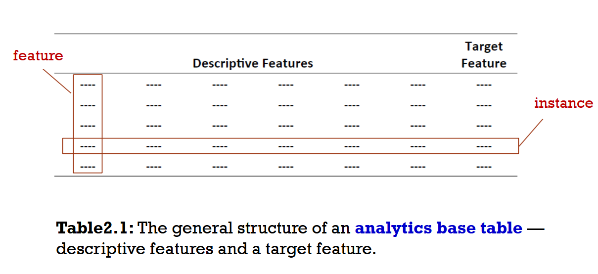

# 把业务问题转化为分析方案
需要回答四个关键问题：

+ 业务问题是什么？
+ 业务方想实现什么目标？
+ 业务现在如何运作？
+ 预测分析模型能以哪些方式帮助解决问题？

案例：机动车保险欺诈

# 可行性评估（Assessing Feasibility）
评估一个分析方案是否可行，主要看两方面：

+ 数据是否可得？
or所需数据是否存在，或能否获取？ 
+ 业务能否消化洞察？
or业务方是否有能力使用模型输出的结果？

# 设计分析基础表（Analytics Base Table，ABT）
**ABT 是把多源历史数据压成「一行一个预测对象、最后一列是标签」的宽表；模型只认这张表。**
## ABT是什么？
Analytics Base Table（分析基础表）：承载历史数据、用于监督学习的基本结构。

术语对齐：

列 = feature（特征）

行 = instance（实例）

最后一列 = target feature（目标特征/标签）

监督学习的矩阵形式就是：

X（描述特征）→y（目标）

X（描述特征）→y（目标）

ABT 就是组织成 (X,y) 的那张表。
## ABT从哪来？
多源合并

## 第一刀：预测对象（prediction subject）
预测对象定义了预测发生的基本粒度

ABT 每行 = 预测对象的一个实例

口诀：one-row-per-subject

## 定特征的正确姿势：领域概念
什么是领域概念

描述预测对象某方面特征的高层抽象，再从中派生出一组进入 ABT 的具体特征。

不要直接问业务“你要哪些字段”，而是问：

“你觉得什么样的理赔更可疑？”

→ 答案往往是概念：理赔太频繁、类型太杂、金额相对保费太高

→ 再把这些概念落成列。

# Designing & Implementing Features
设计feature时的三大考量：
+ Data availability
+ Timing
+ Longevity

feature的几种类型
+ Numeric: True numeric values that allow arithmetic 
operations (e.g., price, age)
+ Interval: Values that allow ordering and subtraction, but 
do not allow other arithmetic operations (e.g., date, time)
+ Ordinal: Values that allow ordering but do not permit 
arithmetic (e.g., size measured as small, medium, or large)
+ Categorical: A finite set of values that cannot be ordered 
and allow no arithmetic (e.g.,country, product type)
+ Binary: A set of just two values (e.g., gender)
+ Textual: Free-form, usually short text data (e.g., name, 
address)
  
时序设计：观测期与结果期

许多模型是 倾向模型（propensity models），天然带时间维度：

+ Observation period（观测期）：计算描述特征所依据的历史区间
+ Outcome period（结果期）：目标是否发生的区间
四种常见情形：

+ 固定时点：所有人观测期、结果期在同一日历区间（如新产品上市后是否购买）
+ 事件对齐：相对各自事件日期分别划分（如保险理赔：观测期在报案前，结果期在报案后）
+ 只有观测期有时间：目标与时间无关（如流失挽留：用过去行为选最小成本优惠）
+ 只有目标有时间：描述特征时间无关（如贷款违约：目标定义含时间窗口）


接下来用课件里的**机动车保险欺诈**，从老板一句抱怨开始，把整条流程走完。你会看到：每一项“定性描述”，最后都变成了表里的某一行、某一列、某一个时间窗口。

---

## 场景设定

你是保险公司数据团队的人。理赔部经理找你：

> “我们调查了大约 30% 的理赔，但欺诈损失还是太高。能不能用数据帮我们优先调查？”

下面按本课四步走。

---

## 第 1 步：把业务问题转成分析方案

课件的四个问题，逐个填：

| 问题 | 你的回答 |
|------|----------|
| 业务问题是什么？ | 欺诈理赔造成赔付损失；调查资源有限 |
| 业务目标？ | 在有限调查人力下，提高命中欺诈的比例，减少漏网和空查 |
| 业务现在怎么运作？ | 理赔提交 → 调查员按经验/随机抽查（约 30%）→ 认定欺诈或真实 → 赔付 |
| 预测模型怎么帮？ | 在**刚提交理赔时**给每笔案子打分，高分优先查 |

从头脑风暴的四个方案里，经理拍板先做：

> **Claim Prediction**：预测「这笔理赔是欺诈」的概率。
> （先不做会员级、投保时点、赔付金额，因为调查动作发生在“单笔理赔”上。）

**分析方案一句话**：

> 对**每一笔新提交的理赔**，用报案前可获得的信息，预测它最终被认定为欺诈的概率，供调查队列排序。

---

## 第 2 步：可行性

**数据**

| 需要什么 | 有没有 |
|----------|--------|
| 历史理赔 + 是否欺诈标签 | 有：调查结论字段 `is_fraud`（调查过才比较可靠） |
| 理赔细节、保单、索赔人 | 有：理赔系统、保单系统、客户主数据 |
| 时间戳 | 有：`claim_date`、调查完成日 |

**业务能力**

| 需要什么 | 能不能 |
|----------|--------|
| 按分数优先调查 | 能：改调查队列排序规则 |
| 分数要足够快 | 能：报案后 T+0 出分，不阻塞录入 |

结论：**可行，可以立项。**
（若历史只有极少数案子标过欺诈，或流程不能改优先级，这里就会否掉。）

---

## 第 3 步：设计 ABT —— 先定“一行是什么”

### 预测对象

> **一行 = 一笔理赔（claim）**，不是一个人，也不是一张保单。

因为：
- 调查动作针对“单笔理赔”
- 同一人可以有多笔理赔，欺诈与否不同
- 标签也挂在“这笔案子”上

这就是 **one-row-per-subject**。

### 时间怎么切（本课最容易懵、也最关键）

对**每一笔理赔**，相对它的 `claim_date` 切两段：

```text
……——————|————————————————|————————→ 时间
          ↑ claim_date
     观测期（Observation）   结果期（Outcome）
     只能用这段时间的数据     等调查结论是否欺诈
     建特征                  写进 target
```

- **观测期**：报案**之前**（例如过去 24 个月）索赔人的行为 → 做描述特征
- **结果期**：报案**之后**调查期间 → 得到标签 `target = 1/0`

**绝不能**用“调查结论出来之后才知道的信息”做特征（比如 `investigator_note`），否则是**未来信息泄漏**，线下指标很好、上线全废。

---

## 第 4 步：领域概念 → 特征 → 表

### 领域概念（和业务一起定）

课件图 2.3 那类结构：

| 领域概念 | 业务含义 |
|----------|----------|
| Claim Frequency | 这人/这笔相关历史理赔是否异常频繁 |
| Claim Types | 险种/伤害类型是否可疑（如大量“软组织”） |
| Claim Details | 金额、地点、与保费关系等 |

### 从概念落到具体列（节选）

| 特征列 | 类型 | 原始/衍生 | 怎么来的 |
|--------|------|-----------|----------|
| NUM_CLAIMS | 数值 | 衍生-聚合 | 观测期内该索赔人理赔次数 |
| NUM_CLAIMS_3M | 数值 | 衍生-聚合 | 近 3 个月理赔次数 |
| AVG_CLAIMS_PER_YEAR | 数值 | 衍生-聚合 | 年均理赔次数 |
| PCT_SOFT_TISSUE | 比例 | 衍生-比率 | 软组织伤害理赔 / 总理赔 |
| CLAIM_AMT | 数值 | 原始 | 本笔理赔金额 |
| CLAIM_TO_PREM | 比例 | 衍生-比率 | 本笔金额 / 已缴保费 |
| REGION | 类别 | 原始 | 事故地区 |
| UNSUCC_CLAIMS | 数值 | 衍生-聚合 | 历史未成功理赔次数 |
| **target_is_fraud** | 0/1 | 目标 | 结果期内调查结论 |

多源数据要 **join** 到“这一行 claim”上：

```text
claims（一行一笔理赔）
  ├─ join policies     → 保费、保单时长
  ├─ join claimants    → 年龄、地区
  └─ 聚合 claims 历史  → 观测期理赔次数、软组织占比等
```

---

## 造 5 行假数据，看 ABT 长什么样

假设我们已经按上面规则算好（单位随意，仅示意）：

| claim_id | claim_date | NUM_CLAIMS | NUM_CLAIMS_3M | PCT_SOFT_TISSUE | CLAIM_AMT | CLAIM_TO_PREM | REGION | target_is_fraud |
|----------|------------|------------|---------------|-----------------|-----------|---------------|--------|-----------------|
| C1001 | 2024-03-12 | 1 | 0 | 0.00 | 2,400 | 0.15 | 北京 | 0 |
| C1002 | 2024-05-02 | 7 | 3 | 0.86 | 18,500 | 2.40 | 河南 | 1 |
| C1003 | 2024-06-18 | 2 | 1 | 0.50 | 5,100 | 0.40 | 北京 | 0 |
| C1004 | 2024-08-01 | 9 | 4 | 1.00 | 22,000 | 3.10 | 河北 | 1 |
| C1005 | 2024-09-20 | 0 | 0 | 0.00 | 1,800 | 0.10 | 上海 | 0 |

直观上已经能看出规律：

- 理赔次数多、近 3 个月扎堆、软组织占比高、金额/保费比高 → 更像欺诈（C1002、C1004）
- 低频、低额、比值低 → 更像真实（C1001、C1005）

模型做的事，就是把这种“直觉”变成**可排序的分数**。

---

## 走到“能决策”：上线后一天发生什么

**某天上午，新进来一笔理赔 C2001**

1. 系统取观测期特征（自动算好一行）
2. 模型输出：`P(fraud) = 0.81`
3. 调查队列：C2001 排到今天前 5%
4. 调查员优先查这笔；若认定欺诈 → 拒赔/调查；若真实 → 正常赔付

对比现在：不看分数，随机/经验抽 30%，同样人力下**命中率**通常更低。

这就是课件最后说的：

> 模型是**帮组织更好决策的工具**，不是终点。
> 决策动作 = **改调查优先级**；没有这个动作，模型没有价值。

---

## 对照：哪些“定性话”变成了什么

| 课件里的说法 | 在例子里变成了 |
|--------------|----------------|
| 业务问题 → 分析方案 | “优先调查” → 预测单笔理赔欺诈概率 |
| 可行性 | 有 `is_fraud` 标签 + 能改队列 |
| one-row-per-subject | 一行一笔 claim |
| 领域概念 | Claim Frequency / Types / Details |
| 衍生特征 | 次数、占比、金额比 |
| 观测期 / 结果期 | 报案前 24 个月 vs 调查结论期 |
| 数据操作 | 多表 join + 按人聚合历史理赔 |
| 目标特征 | `target_is_fraud` |
| 决策 | 高分优先调查 |

