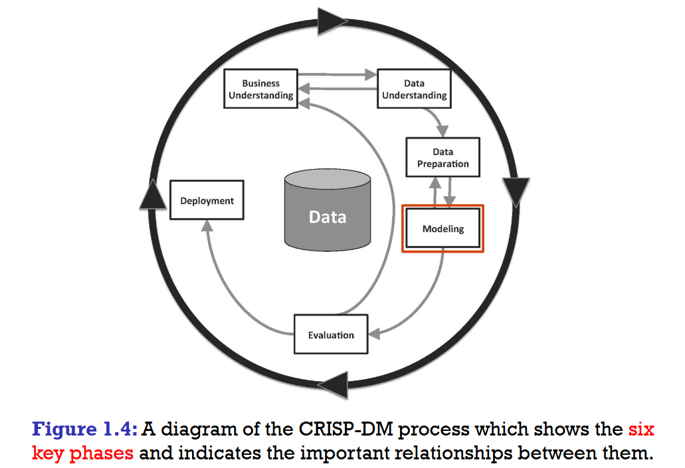

# What is Predictive Data Analytics?   
可预测的：有内在规律的
> Predictive Data Analytics encompasses the business
and data processes and computational models that 
enable a business to make data-driven decisions.

# What is Machine Learning?
> (Supervised) Machine Learning techniques 
automatically learn a model of the relationship 
between a set of descriptive features and a target 
feature from a set of historical examples.
+ supervised 监督

# How Does Machine Learning Work?
> Machine learning algorithms work by searching through 
a set of possible prediction models for the model that 
best captures the relationship between the descriptive 
features and the target feature.
+ ill-posed problem:不适定问题
+ An ill-posed problem is a problem for which a unique 
solution cannot be determined using only the information 
that is available.

选择模型的标准：Inductive bias（归纳偏置）

学习算法为了能够对“从未见过的新数据”做出预测，而必须做出的一系列“先验假设”或“偏好”。

通过inductive bias来应对ill-posed problem从中选出最preferred的solution

summary:

ML algorithms work by searching through sets of potential models. 

There are two sources of information that guide this search: 
+ the training data 
+ the inductive bias of the algorithm

# What Can Go Wrong With ML?
Underfitting and Overfitting

# The Predictive Data Analytics Project Lifecycle: Crisp-DM
One of the most commonly used processes for 
predictive data analytics projects is the Cross Industry 
Standard Process for Data Mining (CRISP-DM)

跨行业数据挖掘标准流程
